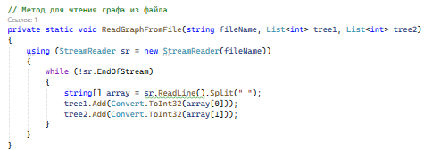
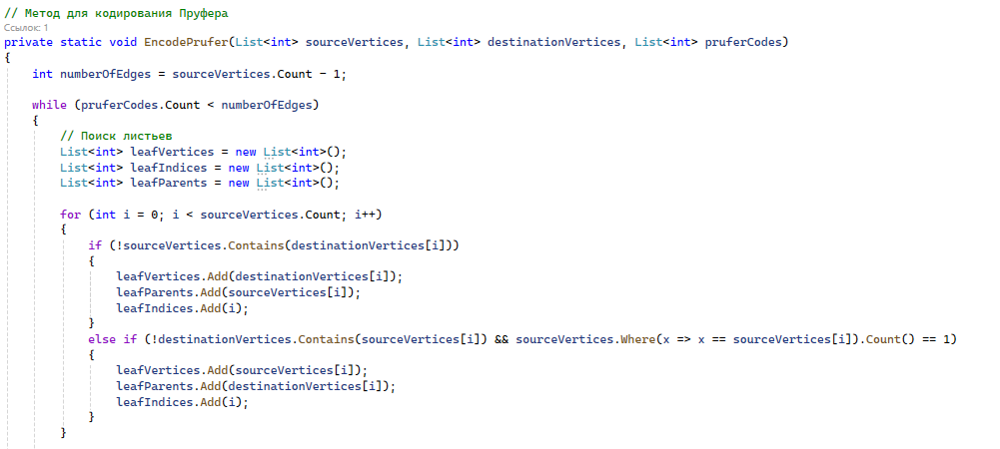
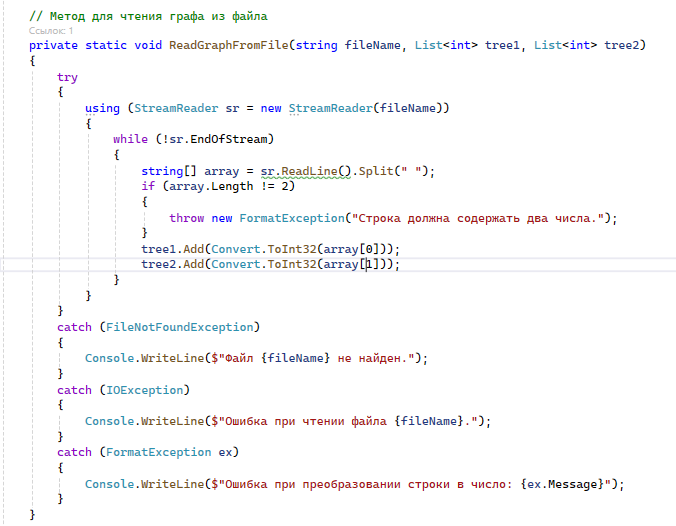
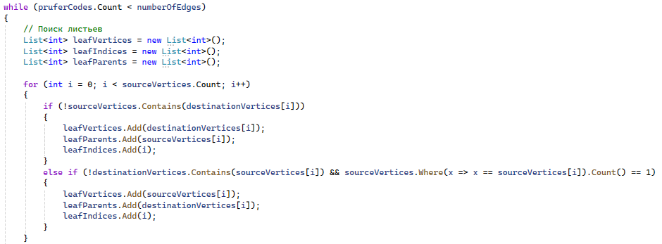
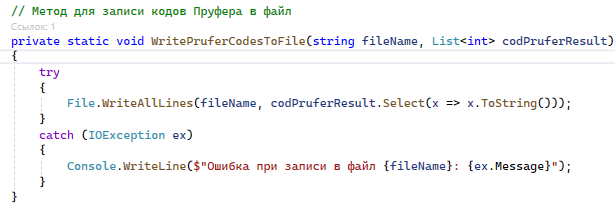

# Refactoring

## Выявленные ошибки
- Структурирование кода (логическое разбиение на методы)

В исходном коде большая часть логики сосредоточена в методе Main(). 
Это делает код менее читаемым и сложным для поддержки. Лучше разделить логику на отдельные методы, 
каждый из которых будет отвечать за свою задачу.

- Нарушение принципа «Не повторяйся»

В исходном коде есть дублирование логики инициализации массивов и других операций. Это можно исправить, вынеся повторяющуюся логику в отдельные методы.

- Неинформативные названия классов, методов и переменных

Использование неинформативных имен классов, методов и переменных затрудняет понимание кода. Лучше использовать более описательные имена.

- Отсутствие обработок исключений

В исходном коде не хватает обработки исключений, что может привести к ошибкам при выполнении программы.
Необходимо добавить обработку исключений для ввода данных и чтения файла.

- Оптимизация алгоритма

Алгоритм кодирования Прюфера можно оптимизировать, используя более эффективные структуры данных и алгоритмы поиска.

- Оптимизация записи в файл

При записи в файл можно использовать более эффективный способ записи, используя File.WriteAllLines вместо цикла foreach.

