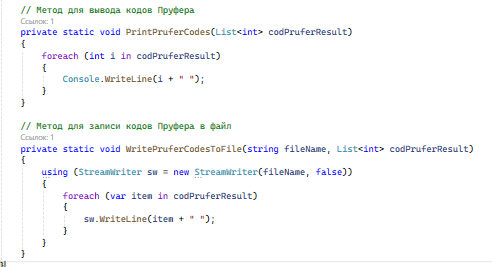

# Refactoring

##Выявленные ошибки
- Структурирование кода (логическое разбиение на методы)
В исходном коде большая часть логики сосредоточена в методе Main(). 
Это делает код менее читаемым и сложным для поддержки. Лучше разделить логику на отдельные методы, 
каждый из которых будет отвечать за свою задачу.

